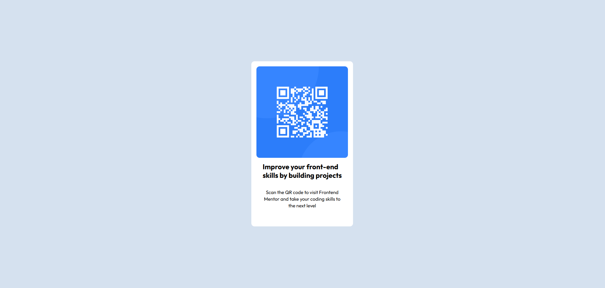

# QR-Code

## Table of contents

- [Overview](#overview)
  - [Screenshot](#screenshot)
  - [Links](#links)
  - [Built with](#built-with)
  - [What I learned](#what-i-learned)
  - [Useful resources](#useful-resources)
- [Author](#author)

## Overview

This is a simple landing page displaying a QR code. The purpose of this exercise is to focus on writing semantic HTML and using the correct elements based on the content. I am training my eye for detail so that my solution matches the design file.

### Screenshot

### Links

- Solution URL: [Add solution URL here](https://github.com/aporter92/QR-Code)
- Live Site URL: [Add live site URL here](https://aporter92.github.io/QR-Code/)

### Built with

- Semantic HTML5 markup
- CSS custom properties
- Flexbox
- CSS Grid

### What I learned

Use this section to recap over some of your major learnings while working through this project. Writing these out and providing code samples of areas you want to highlight is a great way to reinforce your own knowledge.

### Useful resources

- [Figma for developers](https://www.frontendmentor.io/articles/figma-for-developers-how-to-work-with-a-design-file-m6CZKZ1rC1) - helped me remember how to navigate a figma file
- [Markdown guide](https://www.markdownguide.org/) - syntax refresher/cheat sheet

## Author

- Website - [Add your name here](https://www.your-site.com)
- Frontend Mentor - [@yourusername](https://www.frontendmentor.io/profile/yourusername)

**Note: Delete this note and add/remove/edit lines above based on what links you'd like to share.**

